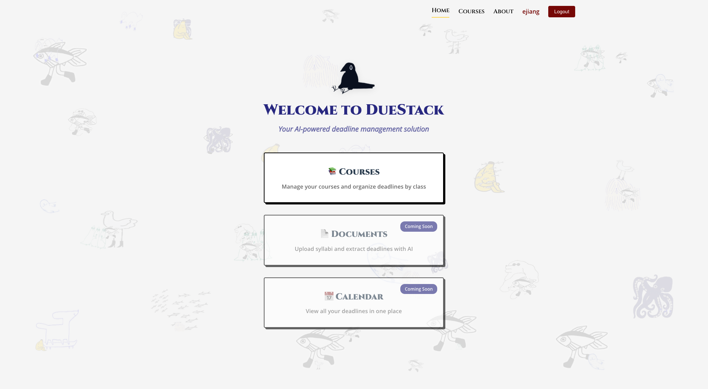

# Assignment 4b



## Oct 28th Complete Deliverables:

1. **[Visual Design Study](<Assignment4b-Oct28-assets/6.1040%20Visual%20Inspo%20-%20DueStack%20(1).pdf>)**

   - **Alternative:** [Google Slides Presentation](https://docs.google.com/presentation/d/1__tKXgUeasagpQDpP_Ei6pshcn3f07D1M1u7-naokl0/edit?usp=sharing)

2. **[Updated User Journey](Assignment4b-Oct28-assets/USER_JOURNEY.md)**

3. **[Updated Screen Recording](https://drive.google.com/file/d/1JZxMdX0P7tXpYUvvh-J2Fhy9J7PkljLw/view?usp=sharing)**

4. **[Backend Design Updates](https://github.com/elainejiangg/Duestack_backend/blob/main/design/concepts/DueStack-specs/ASSIGNMENT_4B_UPDATES.md)** 


---

## Oct 21st Checkin Deliverables

1. **[Updated User Journey](Assignment4b-Oct21-assets/USER_JOURNEY.md)**

2. **[Screen Recording](Assignment4b-Oct21-assets/recording-checkin-4b.mov)**

   - **Alternative:** [Google Drive Video](https://drive.google.com/file/d/1w-uUkEvnyz7VUbl2JhV_xGUIKhSEYgW-/view?usp=sharing)

---

# Duestack Frontend

A modern Vue.js application built with Vue 3, Vite, Vue Router, and Pinia.

## Tech Stack

- **Vue 3** - Progressive JavaScript Framework
- **Vite** - Next Generation Frontend Tooling
- **Vue Router** - Official router for Vue.js
- **Pinia** - Intuitive state management for Vue

## Project Setup

### Prerequisites

- Node.js (v16 or higher)
- npm or yarn

### Installation

1. Clone the repository (if not already cloned)
2. Install dependencies:

```bash
npm install
```

### Development

Run the development server:

```bash
npm run dev
```

The application will be available at `http://localhost:3000`

### Build for Production

Build the application for production:

```bash
npm run build
```

Preview the production build:

```bash
npm run preview
```

## Project Structure

```
src/
├── assets/          # Static assets and global styles
├── components/      # Reusable Vue components
├── router/          # Vue Router configuration
├── stores/          # Pinia stores for state management
├── views/           # Page components
├── App.vue          # Root component
└── main.js          # Application entry point
```

## Recommended IDE Setup

- [VS Code](https://code.visualstudio.com/) + [Volar](https://marketplace.visualstudio.com/items?itemName=Vue.volar)

## Features

- ⚡️ Lightning-fast HMR with Vite
- 🎯 Composition API with `<script setup>`
- 🚦 File-based routing with Vue Router
- 📦 State management with Pinia
- 🎨 Modern and responsive UI

## Getting Started

After running the development server, you can:

1. Edit `src/views/HomeView.vue` to customize the home page
2. Add new components in `src/components/`
3. Create new pages in `src/views/` and add routes in `src/router/index.js`
4. Manage global state using Pinia stores in `src/stores/`

Happy coding! 🚀
